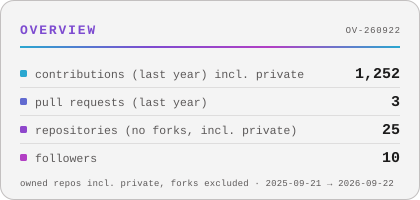
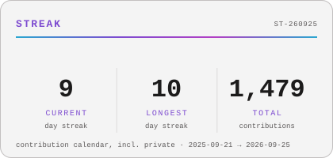
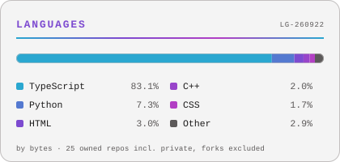

<picture>
  <source media="(prefers-color-scheme: dark)" srcset="assets/banner-dark.svg">
  <source media="(prefers-color-scheme: light)" srcset="assets/banner-light.svg">
  
</picture>

Data engineer working on **payments and streaming systems** — Kafka, Flink, Redis, Java, TypeScript. After hours I build [Enlacey](https://enlacey.com), a services marketplace for my hometown, and small worlds: my portfolio is a [pixel-art game you can walk around](https://naman-gururani.github.io/portfolio/).

<table align="center"><tr><td align="center" width="760"><h3><a href="https://naman-gururani.github.io/portfolio/">▶&nbsp;&nbsp;PLAY MY PORTFOLIO</a></h3></td></tr></table>

<a href="https://naman-gururani.github.io/"><code>&nbsp;SITE&nbsp;</code></a> &nbsp;
<a href="https://naman-gururani.github.io/blog/"><code>&nbsp;BLOG&nbsp;</code></a> &nbsp;
<a href="https://www.linkedin.com/in/naman-gururani"><code>&nbsp;LINKEDIN&nbsp;</code></a> &nbsp;
<a href="mailto:gururaninaman@gmail.com"><code>&nbsp;EMAIL&nbsp;</code></a>

### 🏝 Now

<table>
<tr>
<td width="50%" valign="top">
<picture>
  <source media="(prefers-color-scheme: dark)" srcset="assets/desk-dark.svg">
  <source media="(prefers-color-scheme: light)" srcset="assets/desk-light.svg">
  
</picture>
</td>
<td width="50%" valign="top">
<ul>
<li>Building <b>Enlacey</b> — an all-category on-demand services + jobs marketplace for Haldwani.</li>
<li>Writing field notes on exactly-once pipelines and Hinglish semantic search → <a href="https://naman-gururani.github.io/blog/">the Library</a>.</li>
<li>Most repos are private while they cook; the public ones are meant to be read.</li>
</ul>
</td>
</tr>
</table>

### 📈 The numbers

<table>
<tr>
<td width="50%" valign="top">
<picture>
  <source media="(prefers-color-scheme: dark)" srcset="assets/card-overview-dark.svg">
  <source media="(prefers-color-scheme: light)" srcset="assets/card-overview-light.svg">
  
</picture>
</td>
<td width="50%" valign="top">
<picture>
  <source media="(prefers-color-scheme: dark)" srcset="assets/card-streak-dark.svg">
  <source media="(prefers-color-scheme: light)" srcset="assets/card-streak-light.svg">
  
</picture>
</td>
</tr>
<tr>
<td width="50%" valign="top">
<picture>
  <source media="(prefers-color-scheme: dark)" srcset="assets/card-langs-dark.svg">
  <source media="(prefers-color-scheme: light)" srcset="assets/card-langs-light.svg">
  
</picture>
</td>
<td width="50%" valign="top">
<h3>🛠 What I work with</h3>

<code>Kafka</code> · <code>Kafka&nbsp;Streams</code> · <code>Flink</code> · <code>Redis</code> · <code>Java&nbsp;/&nbsp;Spring&nbsp;Boot</code> · <code>TypeScript</code> · <code>Postgres</code> · <code>Snowflake</code> · <code>Expo/React&nbsp;Native</code>

The Kafka and Java work is behind a company firewall; what lives on this account is mostly TypeScript.

</td>
</tr>
</table>

<picture>
  <source media="(prefers-color-scheme: dark)" srcset="assets/card-heatmap-dark.svg">
  <source media="(prefers-color-scheme: light)" srcset="assets/card-heatmap-light.svg">
  
</picture>

### 📖 Latest field notes
<!-- BLOG-POST-LIST:START -->
- [Building a portfolio you can walk around](https://naman-gururani.github.io/blog/building-a-portfolio-thats-a-game/)
<!-- BLOG-POST-LIST:END -->

### 🐍 The year, eaten

<picture>
  <source media="(prefers-color-scheme: dark)" srcset="https://raw.githubusercontent.com/Naman-Gururani/Naman-Gururani/output/snake-dark.svg">
  <source media="(prefers-color-scheme: light)" srcset="https://raw.githubusercontent.com/Naman-Gururani/Naman-Gururani/output/snake-light.svg">
  
</picture>
